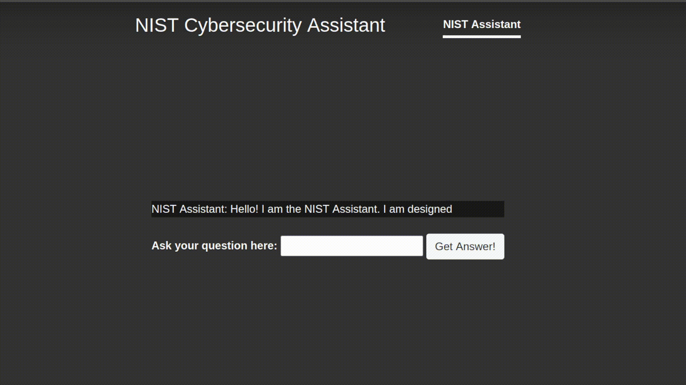
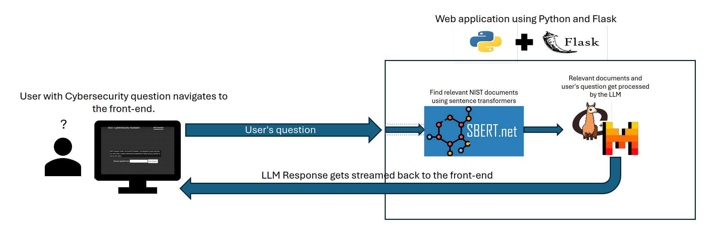

# NIST Digital Assistant Using Large Language Models

## Overview
This project utilizes a 6-bit quantized version of the  [Mistral-Instruct-7B-v0.2](https://huggingface.co/TheBloke/Mistral-7B-Instruct-v0.2-GGUF) Large Language Model (LLM) running on top of [llama.cpp](https://github.com/ggerganov/llama.cpp) along with [Sentence Transformers](https://www.sbert.net/) to develop a digital assistant that is capable of providing Cybersecurity guidance to the user in a chatbot web interface.  The system references the data provided in the SP-800 series documents published by the National Institute of Standards and Technology (NIST).  The chatbot interface runs as a [Flask](https://flask.palletsprojects.com/en/3.0.x/) webapp and just consists of a simple interface built using Javascript and Bootstrap.  The purpose of this project is to provide a starting point for those looking to build a LLM powered chatbot with other large datasets.  The LLM runs better on a GPU, a Nvidia GTX1080ti was used to develop this system, however you can also run this on a system with only a CPU, it will just run really slow.  

The chatbot can answer Cybersecurity related questions using Retrieval Augmented Generation (RAG), which basically just allows a LLM to pull data from a vector / embedding store (Sentence Transformers in the case of this project).  For example, see the GIF below of the chatbot answering the following question: "Provide a list of 10 cybersecurity considerations to take into account when deploying IoT devices on an enterprise network." 

## Application Architecture
The architecture of this application has been kept simple for demonstration purposes. Everything is done through a single Python file which can be found in `flask_app/nist_assistant_application`. The high level overview of the process can be seen below.

1. The user asks a question to the web interface which gets sent to the backend for processing. 

2. The users question gets ingested by Sentence Transformers so we can find the top 5 NIST pages that are most relevant to the user's question.

3. The 5 relevant pages, the users question, and a system prompt (the instructions for the LLM) get sent to the LLM for processing.

4. The LLM processes this data and uses the information in the provided NIST pages to come up with an answer to the user's question. 

5. The response gets streamed back to the user in the web interface.

## Quick Start Guide
1. Download this repo and then cd into the root directory of this project, run the `setup.sh` script.

2. Activate the python environment that was created by the setup script, use the following command: `source venv/bin/activate`

2. cd into the `flask_app` directory and then start the flask application by running the following command:
`flask --app nist_assistant_application run`

3. Open your web-browser and navigate to `http://127.0.0.1:5000/`, you should see the NIST assistant webpage. 

4. Ask the NIST assistant a question using the provided text box.  Monitor the output from the flask command in step 2 to check for status after asking your question, the bot should start responding (may be very slow if you are using your CPU). 

NOTE: If you have a capable NVIDIA GPU, i.e. Pascal architecture or newer with 12GB or more of VRAM, and a supported version of the CUDA toolkit but the LLM is still using your CPU, then you may need to uninstall llama-cpp-python from the Python environment and then reinstall it using the following commands: 

1. `export CUDACXX=/usr/local/cuda/bin/nvcc` (this path may vary depending on your system configuration)

2. `CMAKE_ARGS="-DLLAMA_CUBLAS=on" pip install llama-cpp-python --upgrade --force-reinstall --no-cache-dir`

## Requirements

### Hardware 
- Any modern-ish 64-bit CPU should do
- 16GB of RAM or more
- 10GB of free storage
- NVIDIA [Pascal](https://en.wikipedia.org/wiki/Pascal_(microarchitecture)) GPU or newer with at least 12GB of VRAM - Only if you want to use your GPU to run the LLM

### Software
- Tested on Ubuntu 22.04
- Python 3.11 or newer
- [pdftotext](https://manpages.ubuntu.com/manpages/trusty/man1/pdftotext.1.html) Linux package.
- NVIDIA CUDA Toolkit - Only if you want to use your GPU to run the LLM
- NVIDIA CUDA Drive, tested with version 12.2 - Only if you want to use your GPU to run the LLM

## About the Data
The dataset provided with this repo may prove to be valuable on its own. NIST does not provide an easy way to bulk download files, therefore I had to take a night and download all of the NIST SP-800 series documents one at a time.  The full PDF dataset can be found in `/data/full_pdf_dataset` and consists of all 196 PDF SP-800 series documents available from the NIST website as of 03/19/2024. Note that all "withdrawn" and "draft" documents have been removed from this dataset.

The SP-800 series documents contain guidelines surrounding computer / information security and Cybersecurity best practices. 

There are also raw text files available for each document found in the `/data/full_pdf_dataset` folder. Each text file contains a page of text from a NIST document identified in the title of the text file, the page number from which the content was extracted is also available in each filename. 

## Data Pipeline
I have also included the scripts used to extract the text data from the PDF files and then ingest that data into Sentence Transformers to create an embedding model.  This embedding model is used to provide relevant information to the LLM from the NIST documents based on the user's question. Here are the steps you should take if you would like to reproduce the embeddings for the NIST documents. The scripts needed for this can be found in the `/data` directory.

1. `cd` into the `data` folder.

2. Run the `pdfs_to_text.sh` script.  This file will convert every page in the PDF's found in the `full_pdf_dataset` directory to individual text files using the pdftotext utility.

3. Now we need a separate directory with only the first page of each document.  This will be used later to determine if the document has been deprecated or withdrawn and should not be included in our model.  We only look at the first page because withdrawn / deprecated status always appears on the first page of the SP-800 series documents.  Run the `get_first_pages.sh` script, this will extract the first pages from each of the PDFs in `full_pdf_dataset` and place them in `first_pages`

4. Activate the python environment that you built in the [quickstart guide](#quick-start-guide) using the command: `source ../venv/bin/activate`

5. This step can be skipped as the included dataset already has all "Withdrawn" and "Draft" items removed, in total 185 items were removed from the dataset.  However, if you would like to follow the original pipeline exactly you can now run the `identify_archived_and_withdrawn_files.py` file using the command: `python identify_archived_and_withdrawn_files.py`

6. Finally train the embedding model by running the embedding generator python script: `python embedding_generator.py`.  The model will be saved in the `models` directory at the root of this project when the script has finished.

## LICENSE
The components developed by Braxton VanGundy to create the NIST Assistant are provided under the MIT License. 

However, please be aware that the Mistral-instruct model bundled with this repo is provided under the Apache-2.0 license, a copy of which is provided in the `/models` directory.

